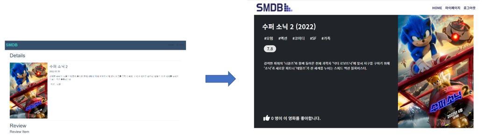
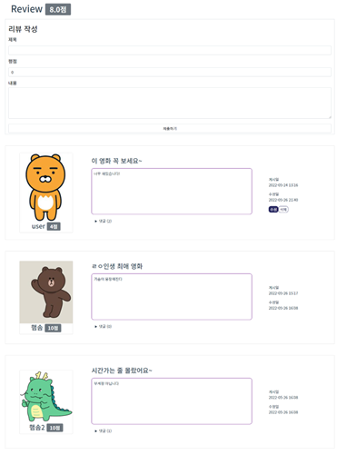

# Movie Project

>오행송 & 윤주혜

## 순서

1. 프로젝트 소개

   1. 목표

   2. 임무분담

   3. ERD

      

2. 프로젝트 과정

   1. 주요 일정

   2. 개발 과정

      

3. 주요 기능

   1.  장르별 추천 영화
   2.  검색기능
   3.  커뮤니티
   4.  마이페이지 영화 담아두기
   
4.  느낀점

## 1. 프로젝트 소개

|           오행송            |                 윤주혜                  |
| :-------------------------: | :-------------------------------------: |
| FrontEnd 개발, CSS 스타일링 | 데이터 수집, BackEnd 개발, CSS 스타일링 |

저희 프로젝트의 테마는 SMDB입니다.

SSAFY Movie Data Base의 약자로 TMDB를 오마주하여 영화 데이터를 기반으로 인기순, 장르별로 사용자에게 영화를 추천하고 영화에 대한 정보를 제공해주는 서비스 입니다.

사용자가 원하는 장르를 선택하면 DB에 존재하는 영화중 선택한 장르의 영화를 정렬 시켜주어 사용자가 원하는 영화의 정보를 받아갈수 있고, 또한 원하는 영화 제목 또는 제목의 일부를 검색할 경우 해당되는 영화들이 검색되어 필요한 정보를 받아 갈 수 있습니다.

영화를 선택할 경우 영화의 상세정보 페이지로 이동하며 해당 페이지를 커뮤니티화 시켜서 사용자들 간의 소통을 활성화 할수있도록 제작했습니다.

### #. ERD

------

------

## 2. 주요 일정

#### 첫째주( 브레인 스토밍)

|      16일       |       17일       |   18일   |       19일        |      20일(개발 시작)      | 21일(주말) |
| :-------------: | :--------------: | :------: | :---------------: | :-----------------------: | ---------- |
| 로그인기능 구상 | 기본 베이스 구상 | ERD 구상 | Vue 컴포넌트 구상 | DB 모델 제작, Vue 틀 제작 | URL 제작   |

#### 둘째주

|   22일(주말)    |                   23일                   |                    24일                    |       25일       |     26일      |
| :-------------: | :--------------------------------------: | :----------------------------------------: | :--------------: | :-----------: |
| 로그인기능 구현 | 검색,정렬 기능 추가, 영화상세페이지 제작 | 영화 좋아요 기능 추가,  커뮤니티 기능 구현 | CSS  , 오류 수정 | CSS, 오류수정 |

> ### #.메인페이지
>
> 
>
> 
>
> 
>
> ### #. 상세정보

## 3. 주요 기능

- Account

  

​																	로그인을 하지 않을 경우 서비스 이용이 제한됩니다.

------

- Home

상단부에는 검색창이 존재하여 본인이 원하는 영화의  제목의 일부를 검색하면 해당 키워드가 포함된 영화들이 모두 검색됩니다. 원하는 영화가 존재하면 선택하여 상세페이지로 이동이 가능합니다.

중앙부에는 요즘 인기 있는 영화들이 정렬되어 제공됩니다. 옆으로 스크롤 하면 많은 영화 데이터를 볼수 있습니다.

하단부에는 장르 선택이 가능하여 전체정렬 또는 각 장르별 선택으로 영화를 정렬 시킬 수 있습니다. 영화 데이터는 DB에 있는 영화중에 해당 장르의 영화가 랜덤으로 선택되어 20개의 영화가 보여집니다. 똑같은 장르를 다시 선택하면 또 다른 다양한 영화들을 불러오게 됩니다.

------

- Detail

상세페이지의 상단부에는 영화 상세 정보가 불러오게 됩니다. 해당 영화가 어떤 장르인지, 관객 평점은 몇점인지, 간단한 줄거리 를 확인할수 있으며 좋아요 버튼을 누를경우 마이페이지에 해당 영화를 담아둘 수 있습니다.

하단부에는 해당 영화에 대한 소통이 가능한 커뮤니티 기능이 존재합니다.  사용자들이 각각 영화 점수를 평가할수 있으며 평균점수가 상단에 표시됩니다. 각자 영화당 평가가 한번 가능하며 각 게시글마다 댓글을 작성할 수있습니다.

게시글은 좌측엔 유저프로필, 중앙엔 게시글 내용, 우측엔 작성기록정보가 주어집니다.

------

- MyPage

  

마이페이지의 상단부에는 각자의 프로필 사진이 변경이 가능합니다. 해당 사진은 게시글을 남길경우 다른 이용자에게 표시됩니다.

중앙부에는 자신이 좋아요를 눌렀던 영화들 데이터가 들어있습니다. 현 페이지에서 좋아요를 취소할수 있고 영화를 선택시 다시 상세페이지로 이동이 가능합니다.

하단부에는 본인이 작성했던 게시글 목록과 그 게시글에 달린 댓글의 수를 볼수 있습니다.

게시글을 선택할 경우 그자리에서 글을 다시 확인, 수정,삭제, 댓글확인이 가능합니다.
